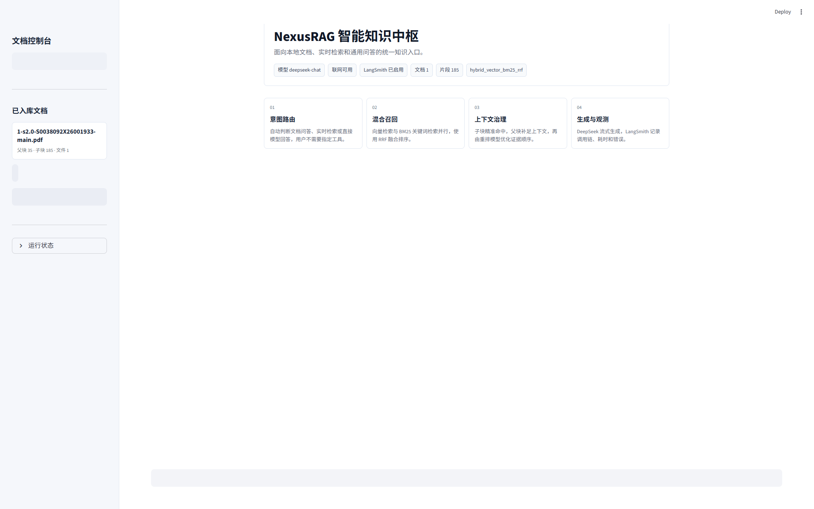

# 企业级知识检索与自适应问答 RAG

这是一个面向企业知识库场景的 CRAG（Corrective RAG）问答系统。项目支持上传 PDF 文档、构建本地向量索引和 BM25 索引，并根据问题意图自动选择本地知识库问答、联网搜索或直接调用大模型回答。

前端使用 Streamlit 构建交互式控制台，后端使用 FastAPI 提供文档管理、检索、重排、流式问答和健康检查接口。系统默认使用 OpenAI 兼容接口调用 DeepSeek 等大模型，也可以接入 OpenAI 兼容的 embedding / rerank 服务。



## 核心功能

- PDF 文档上传、解析、切分、入库和删除
- 父子块切分策略，兼顾精确命中和上下文完整性
- FAISS 向量检索 + BM25 关键词检索 + RRF 融合排序
- 可选 rerank 模型，对候选片段做二次排序
- LangGraph 编排问答流程，实现意图路由、检索、纠偏和生成
- 支持 Tavily 联网搜索兜底，用于实时信息或外部知识查询
- 支持 SSE 流式输出，前端可以逐字显示模型回答
- 支持 LangSmith 观测，可记录调用链路和评估过程
- 提供 RAGAS 评估脚本，生成 JSON 和 Markdown 评估报告

## 项目结构

```text
crag_expert_system/
|-- backend/
|   |-- main.py              # FastAPI 接口入口
|   |-- graph.py             # LangGraph / CRAG 问答流程
|   `-- retriever.py         # PDF 入库、切分、检索、重排
|-- frontend/
|   `-- app.py               # Streamlit 前端控制台
|-- tools/
|   `-- ragas_observability_eval.py
|-- data/
|   `-- eval/
|       `-- ragas_eval_cases.example.json
|-- .env.example             # 环境变量模板，不包含真实密钥
|-- docker-compose.yml
|-- Dockerfile.backend
|-- Dockerfile.frontend
`-- requirements.txt
```

`data/uploads/`、`data/indexes/`、`data/evaluations/`、`.env`、`venv/` 和日志文件默认不会提交到 Git。

## 快速开始

### 1. 创建虚拟环境

```powershell
python -m venv venv
.\venv\Scripts\activate
pip install -r requirements.txt
```

如果需要使用本地 sentence-transformers 或 RAGAS 评估，可以再安装：

```powershell
pip install -r requirements-local-optional.txt
```

### 2. 配置环境变量

复制示例配置：

```powershell
copy .env.example .env
```

然后打开 `.env`，填入自己的服务地址和密钥。不要把 `.env` 提交到 GitHub。

最常用的配置项：

```env
OPENAI_API_KEY="YOUR_DEEPSEEK_API_KEY"
OPENAI_API_BASE="https://api.deepseek.com"
OPENAI_MODEL="deepseek-chat"

EMBEDDING_PROVIDER="api"
EMBEDDING_API_BASE="https://api.siliconflow.cn/v1"
EMBEDDING_API_KEY=""
EMBEDDING_MODEL="BAAI/bge-m3"

TAVILY_API_KEY=""
LANGCHAIN_API_KEY="YOUR_LANGSMITH_API_KEY"
```

说明：

- `OPENAI_API_KEY`：大模型 API Key，后端生成回答时使用。
- `OPENAI_API_BASE`：OpenAI 兼容接口地址。
- `EMBEDDING_PROVIDER`：可设为 `api`、`sentence-transformers` 或使用默认 fallback。
- `EMBEDDING_API_KEY`：远程 embedding 服务需要鉴权时填写。
- `TAVILY_API_KEY`：可选，配置后支持联网搜索。
- `LANGCHAIN_API_KEY`：可选，配置后启用 LangSmith 观测。

### 3. 启动后端

```powershell
uvicorn backend.main:app --host 127.0.0.1 --port 8000 --reload
```

后端健康检查：

```text
http://127.0.0.1:8000/health
```

### 4. 启动前端

新开一个终端：

```powershell
.\venv\Scripts\activate
streamlit run frontend/app.py --server.port 8501
```

浏览器访问：

```text
http://127.0.0.1:8501
```

## Docker 启动

确认 `.env` 已配置后，可以使用 Docker Compose 启动：

```powershell
docker compose up --build
```

服务地址：

- 前端：`http://127.0.0.1:8501`
- 后端：`http://127.0.0.1:8000`

## 主要接口

| 方法 | 路径 | 说明 |
| --- | --- | --- |
| `GET` | `/health` | 查看模型、联网搜索、LangSmith 和知识库状态 |
| `GET` | `/documents` | 查看当前知识库文档和索引统计 |
| `POST` | `/documents/upload` | 上传 PDF 并入库 |
| `DELETE` | `/documents/source` | 按文档名删除入库文档 |
| `POST` | `/documents/reindex` | 根据已上传 PDF 重建索引 |
| `POST` | `/chat` | 普通问答接口 |
| `POST` | `/chat/stream` | SSE 流式问答接口 |
| `POST` | `/embeddings` | OpenAI 风格 embedding 测试接口 |
| `POST` | `/rerank` | rerank 测试接口 |

## 问答流程

系统通过 LangGraph 编排 CRAG 流程：

1. 根据问题判断路由：本地文档、联网搜索或直接模型回答。
2. 本地文档问题进入知识库检索。
3. 检索阶段同时使用向量检索和 BM25，并通过 RRF 融合排序。
4. 如果启用了 rerank，会对候选结果重新排序。
5. 生成阶段把检索上下文交给大模型，输出结构化中文回答。
6. 对实时信息类问题，可使用 Tavily 搜索结果作为外部上下文。

## RAGAS 评估

项目包含一个本地评估脚本：

```powershell
python tools\ragas_observability_eval.py
```

常用参数：

```powershell
python tools\ragas_observability_eval.py --limit 5
python tools\ragas_observability_eval.py --no-ragas
python tools\ragas_observability_eval.py --trace-langsmith
```

评估输入示例位于：

```text
data/eval/ragas_eval_cases.example.json
```

评估报告默认输出到：

```text
data/evaluations/
```

该目录已被 `.gitignore` 忽略，避免把本地评估数据误提交。

## 密钥安全

本项目使用 `.env` 保存本地真实密钥，`.env` 已被 `.gitignore` 忽略。提交或推送前可以用下面命令确认不会上传敏感文件：

```powershell
git status --short --ignored
git add --dry-run .
```

正常情况下，`.env` 应显示为被忽略：

```text
!! .env
```

请只提交 `.env.example`，不要提交 `.env`、日志文件、上传文档、索引文件、评估结果或虚拟环境目录。

## 适用场景

- 企业内部知识库问答
- PDF 论文、报告、制度文档检索
- 支持来源追踪的 RAG 问答系统原型
- RAG 检索策略、重排策略和评估流程实验
- 带观测能力的 LangGraph / FastAPI / Streamlit 应用示例
